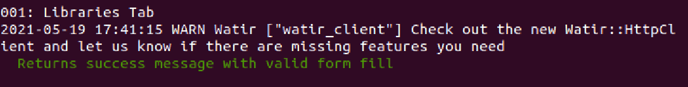

# rspec_circ_manager
## Description
This is the official automation for NYPL Circ Manager.

## Overview
### Folder "spec/admin_form"
This folder contains test specs for administration forms present in the Circ Manager.

All administration forms present in Circ Manager are covered by this test suite EXCEPT for the following forms:
* Search (or Search service configuration)

### Folder "pages"
This folder contains relevant page objects used in testing specs in automation framework.

The two main pages covered in test suite include:
| Page Name | File Name | 
| --------- | --------- |
|Login|circ_login_page.rb|
|Administrative Portal|circ_admin_page.rb|

Additionally, page objects for administrative forms are present in _circ_admin_page.rb_ file.

## Configuration
### Environment variables

Test scripts are run against the teardown QA server at https://disposable-circulation.librarysimplified.org/

The `CIRC_USERNAME` environment variable contains the username to use for authentication, and the `CIRC_PASSWORD` environment variable contains the password.

## How to Run Automation
### Scripts
__NOTE: All commands mentioned here are to be run from the root project folder.__

One can run the following command to run ALL automation with local Chrome browser:
=======
Additionally, page objects for administrative forms are present in circ_admin_page.rb folder.

## How to Run Automation
From the root project folder, one can run the following command to run ALL automation with local Chrome browser:
```
rspec 
```
To run ALL automation headlessly, run the following command:
```
app_type=headless rspec
```
The above commands are meant to run all test specs. To run one file by name, follow this example:
```
rspec spec/admin_form/007_logging_tab_spec.rb
```
### Example of Successful Run (Console Output)
After running a single spec successfully, it will look something like this:


## Future Work
To increase the quality of test framework, the following items should be worked on in the future:
* Refactor _launch_browser_instance_ method in _spec_helper.rb_ file to correctly pass browser instance.
* Replace explicit browser instance creation in each spec with passed-in _launch_browser_instance_ method.
* Replace sleep() in _goto_url_ method in _CircAdminPage_ page object with wait.
* Replace sleep() in _goto_url_ method in _CircAdminPage_ page object with wait.
* Refactor _wait_for_loading_message_ method in _CircAdminPage_ page object to adapt to erratic behavior of loading messages when waiting for them.
* Remove sleeps after refactoring _wait_for_loading_message_ method in _CircAdminPage_ page object (as mentioned in previous point).

## How to Contribute
One can contribute to this automation test suite by branching off this suite, pushing changes from branch, and creating a pull request. Pull requests should pass automatic checks before being pushed to _main_ branch. 

